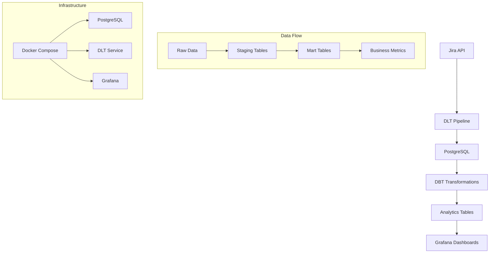

# 🚀 Jira Data Pipeline

A comprehensive data pipeline that extracts data from Jira, transforms it using DBT, and loads it into PostgreSQL for analytics and visualization.

## 📊 Architecture Overview



## 🏗️ Project Structure

```
dlt_jira/
├── jira/                    # DLT source configuration
│   ├── __init__.py
│   └── settings.py
├── dbt/                     # DBT transformations
│   ├── models/
│   │   ├── staging/         # Raw data staging
│   │   └── marts/          # Business logic tables
│   ├── tests/              # Data quality tests
│   └── dbt_project.yml
├── grafana/                # Dashboard configurations
│   ├── dashboards/
│   └── datasources/
├── jira_pipeline.py        # Main pipeline script
├── docker-compose.yml      # Infrastructure setup
├── Dockerfile.dlt         # DLT service container
└── entrypoint.sh          # Container startup script
```

## 🚀 Quick Start

### Prerequisites

- Docker and Docker Compose
- Python 3.12+ (for local development)
- Jira API credentials

### 1. Clone and Setup

```bash
git clone <repository-url>
cd dlt_jira
```

### 2. Environment Configuration

Create a `.env` file with your credentials:

```bash
# Jira API Credentials
JIRA_SUBDOMAIN=your-subdomain
JIRA_EMAIL=your-email@example.com
JIRA_API_TOKEN=your-api-token

# PostgreSQL Configuration
POSTGRES_USER=dlt_user
POSTGRES_PASSWORD=dlt_password
POSTGRES_DB=jira_dw
POSTGRES_HOST=postgres
POSTGRES_PORT=5432

# Grafana Configuration
GRAFANA_USER=admin
GRAFANA_PASSWORD=admin
```

### 3. Run with Docker Compose

```bash
# Start all services
docker-compose up -d

# Run the pipeline
docker-compose exec dlt python jira_pipeline.py all

# Check logs
docker-compose logs -f dlt
```

## 🛠️ Local Development

### Setup Python Environment

```bash
# Create virtual environment
python -m venv venv
source venv/bin/activate  # On Windows: venv\Scripts\activate

# Install dependencies
pip install -r requirements.txt

# Run pipeline locally
python jira_pipeline.py all
```

### Pipeline Options

```bash
# Load all data (projects, users, issues)
python jira_pipeline.py all

# Load only issues (incremental)
python jira_pipeline.py incremental

# Load specific data types
python jira_pipeline.py issues
python jira_pipeline.py projects
python jira_pipeline.py users
```

## 📈 Data Models

### Staging Tables (Raw Data)
- `stg_jira_issues` - Raw issue data
- `stg_jira_projects` - Project information
- `stg_jira_users` - User details
- `stg_jira_changelog` - Issue change history

### Mart Tables (Business Logic)
- `dim_projects` - Project dimensions
- `dim_users` - User dimensions
- `fct_issues_details` - Issue facts
- `fct_transitions` - Issue transition history
- `fct_user_performance` - User performance metrics

## 🔧 Configuration

### DLT Configuration

The pipeline uses DLT for data extraction with the following features:
- **Incremental loading** for issues (last 5 days)
- **Full refresh** for projects and users
- **Automatic schema evolution**
- **Data quality validation**

### DBT Configuration

DBT transformations include:
- **Data cleaning and standardization**
- **Business logic implementation**
- **Data quality tests**
- **Documentation generation**

## 🧪 Testing

### Run DBT Tests

```bash
# Run all tests
dbt test

# Run specific test
dbt test --select test_name

# Run tests for specific model
dbt test --select model_name
```

### Data Quality Checks

The pipeline includes comprehensive data quality tests:
- ✅ Issues have valid status values
- ✅ Project completion percentages are valid
- ✅ User assignments are consistent
- ✅ Date fields are properly formatted

## 📊 Monitoring and Visualization

### Grafana Dashboards

Access Grafana at `http://localhost:3000` with credentials:
- Username: `admin`
- Password: `admin`

Available dashboards:
- **Issues Overview** - Issue status and trends
- **Project Performance** - Project completion metrics
- **Team Performance** - User productivity metrics

### Pipeline Monitoring

```bash
# Check pipeline status
docker-compose ps

# View logs
docker-compose logs -f dlt

# Check database
docker-compose exec postgres psql -U dlt_user -d jira_dw
```

## 🚀 Production Deployment

### GitHub Actions CI/CD

The pipeline includes automated CI/CD with GitHub Actions:

#### Development Environment
- Runs on every push to `develop` branch
- Uses Docker Compose for local services
- Executes incremental data loads
- Generates DBT artifacts

#### Production Environment
- Runs on push to `main` branch
- Connects to cloud PostgreSQL
- Executes full data loads
- Includes health checks and notifications

### Environment Variables for Production

```bash
# Required secrets in GitHub repository
JIRA_SUBDOMAIN
JIRA_EMAIL
JIRA_API_TOKEN
DEV_POSTGRES_USER
DEV_POSTGRES_PASSWORD
DEV_POSTGRES_DB
PROD_POSTGRES_USER
PROD_POSTGRES_PASSWORD
PROD_POSTGRES_DB
PROD_POSTGRES_HOST
PROD_POSTGRES_PORT
```

## 🔒 Security Considerations

### API Security
- ✅ API tokens stored as GitHub secrets
- ✅ No hardcoded credentials in code
- ✅ Environment-based configuration
- ✅ Secure credential management

### Database Security
- ✅ Connection timeouts configured
- ✅ Environment-specific credentials
- ✅ No sensitive data in logs
- ✅ Secure connection parameters

### Container Security
- ✅ Minimal base images
- ✅ Non-root user execution
- ✅ Security updates applied
- ✅ Resource limits configured

## 📚 Documentation

### Generated Documentation
- DBT documentation: `dbt/target/index.html`
- Pipeline logs: `logs/dbt.log`
- Database schema: Available in PostgreSQL

### API Documentation
- Jira API: [Atlassian Developer Documentation](https://developer.atlassian.com/cloud/jira/platform/rest/v3/)
- DLT Documentation: [DLT Hub](https://dlthub.com/)
- DBT Documentation: [DBT Core](https://docs.getdbt.com/)

## 🐛 Troubleshooting

### Common Issues

#### Pipeline Fails to Start
```bash
# Check Docker services
docker-compose ps

# Check logs
docker-compose logs dlt

# Restart services
docker-compose restart
```

#### Database Connection Issues
```bash
# Test PostgreSQL connection
docker-compose exec postgres pg_isready -U dlt_user -d jira_dw

# Check environment variables
docker-compose exec dlt env | grep POSTGRES
```

#### DBT Transformation Errors
```bash
# Check DBT logs
docker-compose exec dlt cat /tmp/dbt_logs/dbt.log

# Run DBT debug
docker-compose exec dlt dbt debug
```

### Performance Optimization

#### Database Tuning
```sql
-- Check table sizes
SELECT schemaname, tablename, pg_size_pretty(pg_total_relation_size(schemaname||'.'||tablename)) as size
FROM pg_tables WHERE schemaname = 'jira_analytics';

-- Check query performance
EXPLAIN ANALYZE SELECT * FROM jira_analytics.fct_issues_details LIMIT 10;
```

#### Pipeline Optimization
- Use incremental loading for large datasets
- Schedule pipeline during off-peak hours
- Monitor memory usage and adjust Docker resources
- Implement data retention policies

## 🤝 Contributing

### Development Workflow
1. Fork the repository
2. Create a feature branch
3. Make your changes
4. Add tests for new functionality
5. Submit a pull request

### Code Standards
- Follow PEP 8 for Python code
- Use meaningful variable names
- Add docstrings to functions
- Include type hints where appropriate
- Write comprehensive tests

## 📄 License

This project is licensed under the MIT License - see the LICENSE file for details.

## 🆘 Support

For support and questions:
- Create an issue in the repository
- Check the troubleshooting section
- Review the documentation
- Contact the development team

---

**Built with ❤️ using DLT, DBT, PostgreSQL, and Docker**